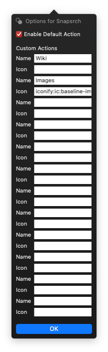

# Snapsrch PopClip Extension

  

This a PopClip extension for [Snapsrch](https://snapsrch.sparklide.com/).

## Install

Download the **Snapsrch.popclipextz** file from [Release](https://github.com/drunlin/Snapsrch.popclipext/releases) and double click to install it.

## How to use

#### Search with default action

Click the Snapsrch icon in the PopClip menu to search with the default action. You can uncheck the `Enable Default Action` option in the Options to remove the icon from the PopClip menu.

#### Search with specific actions

Add the action names to the `Custom Actions` list in the Options. Refer to the [PopClip-Extensions](https://github.com/pilotmoon/PopClip-Extensions#icons) doc for customizing icons. The action names are displayed if their icons are not set.
